# 🤖 NVBuddy


An AI-powered "Study Buddy" designed to help candidates prepare for NVIDIA Solutions Architect (SA) interviews. This tool leverages a **Dual-Brain Agent** architecture to simulate technical deep dives, system design discussions, and hardware sizing calculations. Took help from Gemini 3 Pro (GenAI) to develop a sizeable portion of the codebase. Idea was completely mine to just help me anticipate questions during interview if questions are asked based on NVIDIA Products. 

---

## 🧠 Core Features

### 1. Dual-Brain Architecture
The agent intelligently routes your queries to the most appropriate "expert":
- **🟢 NVIDIA Tutor (Technical)**: A RAG-enabled expert on NVIDIA technologies (NeMo, H100, Triton, etc.). It adopts a "Skeptical CTO" persona to challenge your understanding and relates concepts directly to your resume.
- **🔵 General Tutor (System Design)**: A Socratic interviewer for general coding and system design questions. It helps you structure your answers using frameworks like STAR or RESHAPED.
- **🧮 Hardware Calculator**: Automatically handles complex VRAM and GPU sizing math (e.g., "How many H100s for Llama 3 70B?").
- **🚀 Deployment Expert**: Simulates scenarios for optimizing inference with Triton Inference Server and TensorRT-LLM.

### 2. Sequential Thinking
Just like a real candidate, the agent uses a "Check-Plan-Act" loop to structure its thoughts before responding, ensuring high-quality, structured answers.

### 3. Resume Integration
The agent ingests your `resume.pdf` to provide personalized context. If you ask "Where do I start?", it identifies gaps in your experience relative to NVIDIA's requirements.

---

## 🛠️ Technology Stack

- **Orchestration**: [LangGraph](https://langchain-ai.github.io/langgraph/) (Stateful multi-actor orchestration)
- **LLM**: Llama-3.1-70B via [NVIDIA AI Endpoints](https://build.nvidia.com/explore/discover)
- **Frontend**: [Streamlit](https://streamlit.io/)
- **Vector Store**: FAISS (for NVIDIA Docs and Resume RAG)
- **Tools**: Custom MCP-style tools for Sequential Thinking and Math.

---

## 📂 Project Structure

```bash
├── app.py                  # Streamlit Frontend
├── main.py                 # CLI Entry Point
├── lab1_agent/             # Core Agent Logic
│   ├── graph.py            # LangGraph Workflow Definition
│   ├── chains.py           # LangChain Prompts & Router
│   ├── mcp_server.py       # Tools (Search, Math, Simulation)
│   └── ingest.py           # RAG Data Ingestion Scripts
├── requirements.txt        # Python Dependencies
└── resume.pdf              # Your Resume (Context Source)
```

---

## 🏗️ Technical Architecture

### 1. The "Dual-Brain" Logic (LangGraph)
The core of the agent is a **Stateful Graph** (`lab1_agent/graph.py`) that orchestrates the conversation flow. Unlike simple chatbots, this agent "thinks" before it speaks and routes questions to specialized sub-agents.

**The Workflow:**
1.  **Router**: Analyzes the user's intent.
    -   *Technical Question?* -> **NVIDIA Tutor**
    -   *Coding/Design?* -> **General Tutor**
    -   *Math/Sizing?* -> **Hardware Calculator**
    -   *Optimization?* -> **Deployment Expert**
2.  **Sequential Thinking**: Before answering, the agent enters a `thinking_node` loop (simulated for this lab). It breaks down the user's query into steps:
    -   Step 1: Analyze Intent
    -   Step 2: Structure Lesson
    -   Step 3: Review against Best Practices
3.  **RAG & Context**:
    -   **NVIDIA Tutor** retrieves docs from the vector store (`nvidia_faiss_index`) AND your resume (`resume_cv_index`).
        -   It fuses this context to give personalized advice (e.g., "Since you've done X, you should look at Y").

### 2. Component Deep Dive
| Component | File | Description |
| :--- | :--- | :--- |
| **Graph Orchestrator** | `lab1_agent/graph.py` | Defines the `StateGraph`, nodes, and conditional edges. Manages the shared state (`GraphState`). |
| **Router Chain** | `lab1_agent/chains.py` | Uses structured output (Pydantic) to classify queries into 4 categories. |
| **MCP Tools** | `lab1_agent/mcp_server.py` | Implements the "Hands" of the agent: `_search_nvidia_docs`, `_calculate_gpu_memory`, etc. |
| **RAG Ingestion** | `lab1_agent/ingest.py` | Handles the embedding of NVIDIA documentation and the user's PDF resume into FAISS indices. |

### 3. Data Flow Diagram

```mermaid
graph TD
    Start([User Input]) --> Router{Router}
    
    Router -->|General| Think[Thinking Loop]
    Router -->|Technical| Retrieve[Retrieve Docs]
    Router -->|Hardware| Calc[GPU Calculator]
    Router -->|Deploy| Sim[Deployment Sim]
    
    Retrieve --> Think
    
    Think -->|Plan Ready| Decider{Context?}
    
    Decider -->|Yes| NVT[🟢 NVIDIA Tutor]
    Decider -->|No| GT[🔵 General Tutor]
    
    Calc --> NVT
    Sim --> NVT
    
    NVT --> End([Final Answer])
    GT --> End
```


### 4. RAG & Knowledge Architecture
The agent uses a **Hybrid RAG** approach to combine general NVIDIA knowledge with your specific resume context.

**The Pipeline (`lab1_agent/ingest.py` & `ingest_resume.py`):**
1.  **Sources**:
    -   **Live Web**: `WebBaseLoader` scratches ~50+ NVIDIA blog posts and documentation pages.
    -   **Resume**: `PyPDFLoader` ingests your `resume.pdf`.
2.  **Splitting**:
    -   Uses `RecursiveCharacterTextSplitter` (Chunk Size: 1000, Overlap: 100) to keep semantic context intact.
3.  **Embeddings**:
    -   Model: **`nvidia/nv-embedqa-e5-v5`** (State-of-the-art retrieval model).
    -   This model is specifically optimized for technical Q&A.
4.  **Vector Store**:
    -   **FAISS** (Facebook AI Similarity Search) stores the dense vectors locally.
    -   Two separate indices: `nvidia_faiss_index` (External Knowledge) and `resume_cv_index` (Personal Context).

### 5. Model Context Protocol (MCP) & Tools
We implement the "Hands" of the agent using a pattern inspired by **MCP (Model Context Protocol)**. This separates the *tools* from the *LLM*, allowing for a strictly typed tool interface (`lab1_agent/mcp_server.py`).

| Function Name | Description | Inputs | Source File |
| :--- | :--- | :--- | :--- |
| `_search_nvidia_docs` | Semantic search over the FAISS index. | `query: str` | `mcp_server.py` |
| `_calculate_gpu_memory` | Deterministic math for standard LLM sizing. | `params_billion: float`, `precision: str` | `mcp_server.py` |
| `_sequential_thinking` | A meta-tool that forces the LLM to output its plan step-by-step. | `thought: str`, `step: int` | `mcp_server.py` |

---

## 🚀 Getting Started

### Prerequisites
- Python 3.10+
- An NVIDIA AI Foundation Models API Key

### Installation

1. **Clone the repository**:
   ```bash
   git clone <repo-url>
   cd "NVIDIA Solutions Architect Interview Prep"
   ```

2. **Install dependencies**:
   ```bash
   pip install -r requirements.txt
   ```

3. **Set up Environment**:
   Create a `.env` file in the root directory:
   ```env
   NVIDIA_API_KEY=nvapi-your-key-here
   ```

4. **Ingest Data (First Run Only)**:
   Ensure your `resume.pdf` is in the root, then build the vector index:
   ```bash
   python lab1_agent/ingest.py
   python lab1_agent/ingest_resume.py
   ```

### Running the Application

**Web Interface (Recommended)**:
```bash
streamlit run app.py
```

**CLI Mode**:
```bash
python main.py
```

---

## 📸 Screenshots

*(Add screenshots of the Streamlit UI here)*

---

*Disclaimer: This is a study tool and not an official NVIDIA product.*
